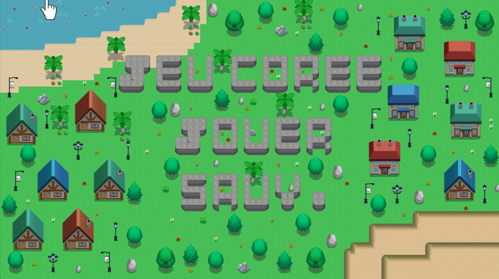
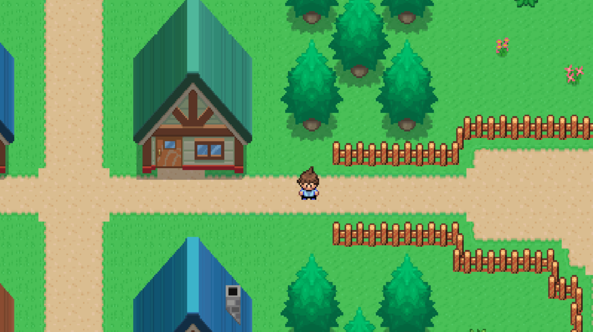
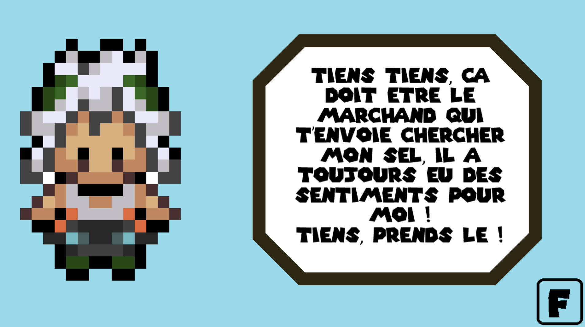
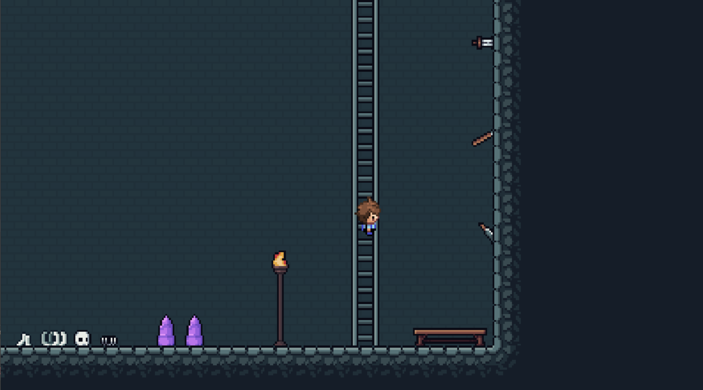

# Jeu Coree 2024 - Aventure RPG 🎮

Un jeu d'aventure et d'exploration en 2D développé en C, mêlant quêtes, exploration et mini-jeux.



## À propos du projet

Ce projet est un jeu de rôle (RPG) old-school où le joueur incarne un personnage devant explorer un monde, collecter des objets (fleurs, poissons, ingrédients) et résoudre des quêtes pour progresser.

Le jeu intègre plusieurs mécaniques :
* **Exploration** d'une carte ouverte avec gestion de caméra (scrolling).
* **Système d'intérieur/extérieur** (maisons, grottes).
* **Système de dialogue** avec des PNJ.
* **Inventaire et Quêtes** (récupération de clés, sel, poivre, etc.).
* **Sauvegarde et Chargement** de la progression.

## Note Technique 

**Ce projet est une archive de code.**

Il a été développé initialement en utilisant la bibliothèque graphique **Allegro 4**. Cette version de la bibliothèque est ancienne et nécessite un environnement spécifique pour être compilée aujourd'hui.

Pour faire fonctionner ce code, l'environnement suivant est requis :
* **Compilateur :** MinGW 32-bits (x86).
* **Bibliothèque :** Allegro 4.4 (version 32-bits).

*Le code n'est pas compatible nativement avec les compilateurs 64-bits modernes ou Allegro 5 sans une réécriture majeure. Il est mis à disposition ici à des fins de démonstration, de portfolio et d'archivage.*

## Contrôles

Le jeu se joue au clavier :

| Touche | Action |
| :--- | :--- |
| **Z / Q / S / D** (ou WASD) | Déplacer le personnage |
| **E** | Interagir / Action |
| **F** | Passer les dialogues |
| **TAB** | Afficher la carte (Map) |
| **CTRL + S** | Sauvegarder la partie |
| **ECHAP** | Quitter |

## Structure du projet


```text 
├── cmake-build-debug/
├── Code/ 
├── components/            
│   ├── fin.c             
│   ├── grotte.c           # Gestion des zones spécifiques
│   ├── main.c             # Point d'entrée et boucle principale
│   ├── maison.c           # Gestion des zones spécifiques           
│   ├── menu.h             
│   └── sous_main.c        # Gestion des collisions et des interactions globales
├── decor_map/             # Contient les assets graphiques (Sprites, Tilesets, Bitmaps)
```
## Galerie

### Exploration et Monde


### Dialogues et Interactions


### Intérieurs et Grotte


## 📬 Contact

Je suis actuellement étudiant en **Ing4 - Cybersécurité** à l'ECE Paris et suis ouvert aux opportunités.

* **Email :** [gabriel.dalibert@edu.ece.fr](mailto:gabriel.dalibert@edu.ece.fr)
* **Localisation :** Paris, France

---
*© 2026 Gabriel Dalibert - Built with Allegro*